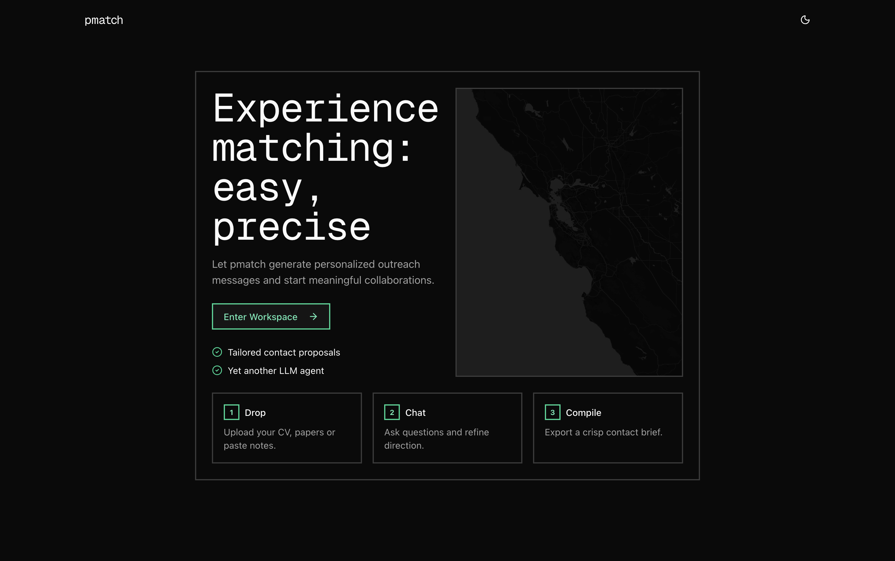
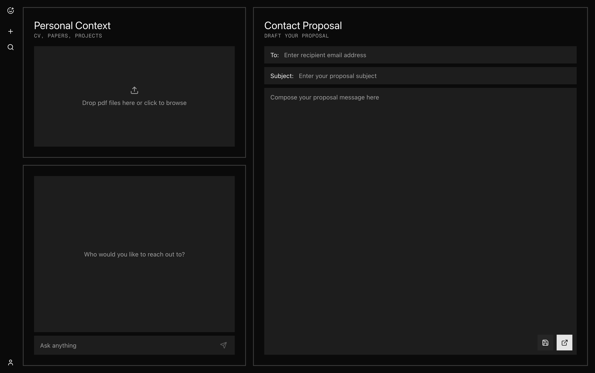
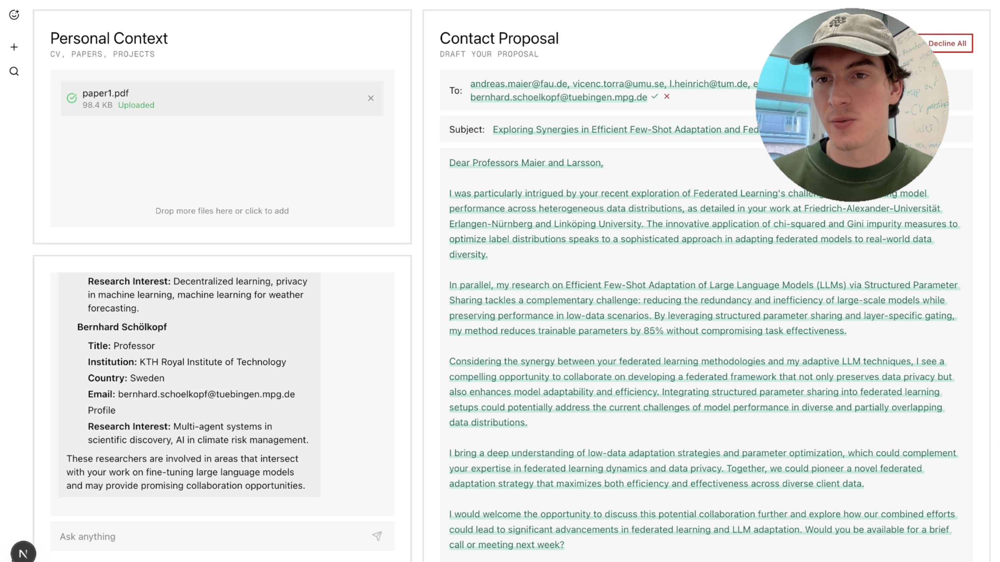
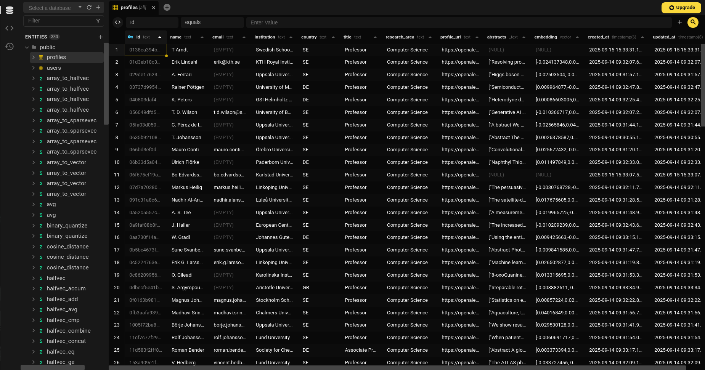
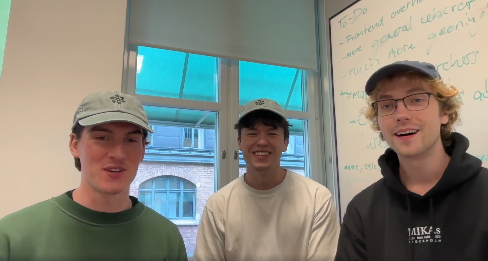

# pmatch : connect with the right researchers


Research positions are increasingly competitive, with students applying to every opening they can find. While LinkedIn or university portals make applying easy, **reaching out directly to professors and researchers is often far more effective**. You gain insight into their work and greatly improve your chances. This is where **pmatch** comes in: it scrapes the web for institutes, finds the right people, and interactively matches your profile to theirs to support impactful cold mails.

## Backend & Data Engineering

- **Database**: PostgreSQL with pgvector extension for semantic search
- **Document Processing**: Auto-detects CV vs Research Papers
- **Vector Embeddings**: OpenAI text-embedding-3-small (1536 dimensions)
- **Search Performance**: IVFFlat index optimized for real-time similarity queries
- **Web Scraping**: Automated researcher profile collection from university directories
- **Similarity Matching**: Cosine distance-based semantic researcher matching
- **API**: FastAPI with async processing for document upload and matching
- **Email Generation**: GPT-4o powered personalized outreach messages

## Contributors
- [maxdcmn](https://github.com/maxdcmn)
- [NikVis01](https://github.com/NikVis01)
- [ltumat](https://github.com/ltumat)

## Screenshots












## Project Structure

```
pmatch/
├── frontend/                 # Next.js frontend application
│   ├── src/app/              # App Router pages
│   ├── src/components/       # shadcn/ui primitives & custom components
│   ├── src/hooks/            # Client-side hooks
│   └── src/lib/              # API client and shared utilities
│
├── backend/                  # FastAPI service & data scraper
│   ├── app.py                # FastAPI entrypoint
│   ├── db/                   # Postgres/pgvector data access helpers
│   ├── utils/                # LLM orchestration & embeddings
│   ├── user_info/            # CV & paper parsing pipelines
│   ├── scraper/              # Researcher scraping scripts
│   ├── goatedscraper/        # Improved scraper
│   ├── kth_matcher/          # KTH-specific researcher matching
│   ├── fake_data/            # Sample PDFs for local testing
│   └── docker-compose.yml    # Local pgvector-enabled Postgres
└── assets/                   # README and marketing imagery
```

## Installation

### Frontend

1. Install dependencies:

   ```bash
   cd frontend
   pnpm install
   ```

2. Start the development server:

   ```bash
   pnpm dev
   ```

3. Open [http://localhost:3000](http://localhost:3000) in your browser.

---

### Backend

1. Spin up the pgvector-enabled Postgres database:

   ```bash
   cd backend
   docker compose up -d
   ```

2. Install Python dependencies:

   ```bash
   python -m venv .venv
   source .venv/bin/activate
   pip install -r requirements.txt
   ```

3. Copy the sample environment file and provide API keys:

   ```bash
   cp .env.example .env
   # Fill in OPENAI_API_KEY, TAVILY_API_KEY, OPENALEX credentials, etc.
   ```

4. Run the FastAPI server:

   ```bash
   uvicorn app:app --reload
   ```

5. Visit [http://localhost:8000/docs](http://localhost:8000/docs) for API docs.
